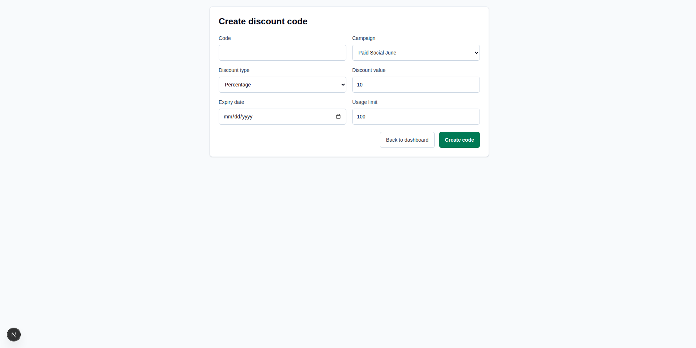

# Discount Codes Frontend

React and Next.js client for the internal discount code tool. The app consumes
the NestJS backend on port `3000` and runs locally on port `3001`.

<p>
  
</p>

<p>
  
</p>

## Tech Stack

- Next.js 16 App Router
- React 19
- TypeScript
- Tailwind CSS 4
- Vitest
- Testing Library

## Setup

Install dependencies from this directory:

```bash
pnpm install
```

Create an optional local environment file if the backend is not running at the
default URL:

```bash
NEXT_PUBLIC_API_BASE_URL=http://localhost:3000
```

Start the frontend on port `3001`:

```bash
pnpm dev
```

The backend should be running separately from `../backend`:

```bash
cd ../backend
pnpm prisma:seed
pnpm start:dev
```

## Screens

- `/`: dashboard with usage summary, campaign usage, and discount code table.
- `/discount-codes/new`: form for creating a discount code.
- `/discount-codes/[id]`: detail view for one discount code.

## Data Flow

The API client lives in `lib/discount-codes/api.ts`.

- `getDiscountCodes()` reads `GET /discount-codes`.
- `getDiscountCode(id)` reads `GET /discount-codes/:id`.
- `createDiscountCode(input)` posts to `POST /discount-codes`.
- `createCampaign(input)` posts to `POST /campaigns` from the campaign modal in
  the discount-code form.
- `redeemDiscountCode(code)` posts to `POST /discount-codes/:code/redeem`.
- `getCampaigns()` reads `GET /campaigns`.
- `getUsageSummary()` reads `GET /campaigns/usage-summary` and adapts the
  backend response into the summary cards used by the dashboard.

The dashboard updates the redeemed row and refreshes the usage summary after a
successful redemption without a full page reload.

## Scripts

```bash
pnpm dev       # run the client on port 3001
pnpm build     # production build
pnpm start     # serve the production build on port 3001
pnpm lint      # ESLint
pnpm test      # Vitest test suite
```

## Tests

The frontend tests cover the main UI and API-client behavior:

- dashboard rendering and redemption flow
- discount code form submission and modal campaign creation
- discount code detail redemption
- API client URL construction, error handling, and endpoint mapping

Run all frontend checks:

```bash
pnpm lint
pnpm test
pnpm build
```

## Trade-offs

- The UI uses client components because the assignment emphasizes direct API data
  flow and in-place redemption updates.
- The form creates campaigns through a modal instead of a separate screen, which
  keeps the cold-start path close to discount-code creation.
- Summary cards are derived from the backend usage-summary endpoint. The backend
  does not currently return expiry metadata in that endpoint, so the frontend
  does not count expired codes in the summary panel yet.
- The interface is intentionally plain and operational: a table, form, and
  summary panel over heavier visual design.
